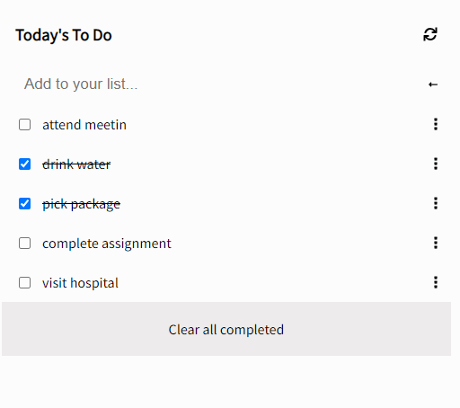

 

# To-Do-List

A web app that helps you organize your day. It simply lists the things that you need to do and allows you to mark them as complete. It is built with ES6 and Webpack!

## Built With

JS

CSS

HTML

Webpack

### 🔴 [Live Link](https://626e5ac8a92f1b301e871a90--fanciful-stroopwafel-1c6022.netlify.app/#)

### DEMO



# Getting Started

### Prerequisites

[Node](https://nodejs.org/en/download/)

### Setup
1. Git [clone]("https://github.com/jmoseka/To-Do-List") this repository to your local machine
>   ```git clone https://github.com/jmoseka/To-Do-List``` 

>   ``` cd To-Do-List```

2. Download as [zip](https://github.com/jmoseka/To-Do-List.git) and extract the files to your local machine

<hr>

### Installations
Run ```npm install``` to install all modules that are listed on package.json file and their dependencies.

(if needed)
Run ```npm update``` to update all packages in the node_modules directory and their dependencies.

<hr>

### Usage
Use [liverserver](https://marketplace.visualstudio.com/items?itemName=ritwickdey.LiveServer#:~:text=Shortcuts%20to%20Start%2FStop%20Server&text=Open%20a%20HTML%20file%20and,on%20Open%20with%20Live%20Server%20.&text=Open%20the%20Command%20Pallete%20by,Server%20to%20stop%20a%20server) to open and run the project in the browser

<hr>

### Run tests

Run tests with jest

`npm test`

Run tests on the .css files
```npx stylelint "**/*.{css,scss}"```

Run tests on the .js files
```npx eslint ```

Run ALL tests on the pull request 

<hr>

### Deployment
Files can be deployed with github pages

## Author 👤

Jamila Moseka

- GitHub: [jmoseka](https://github.com/jmoseka)
- LinkedIn [jamila-moseka](https://www.linkedin.com/in/jamila-moseka/)
- Twitter [@milamoseka](https://twitter.com/milamoseka)

Michael Ugochukwu

- GitHub: [Mikelobi](https://github.com/Mikelobi)

<hr>

## Contributing 🤝 

Contributions, issues, and feature requests are welcome!

## Acknowledgments 🥇
All the devs who build softwares that we use to make code

## Show your support

Give a ⭐️ if you like this project!

## 📝 License

This project is [MIT](./LICENSE) licensed.

